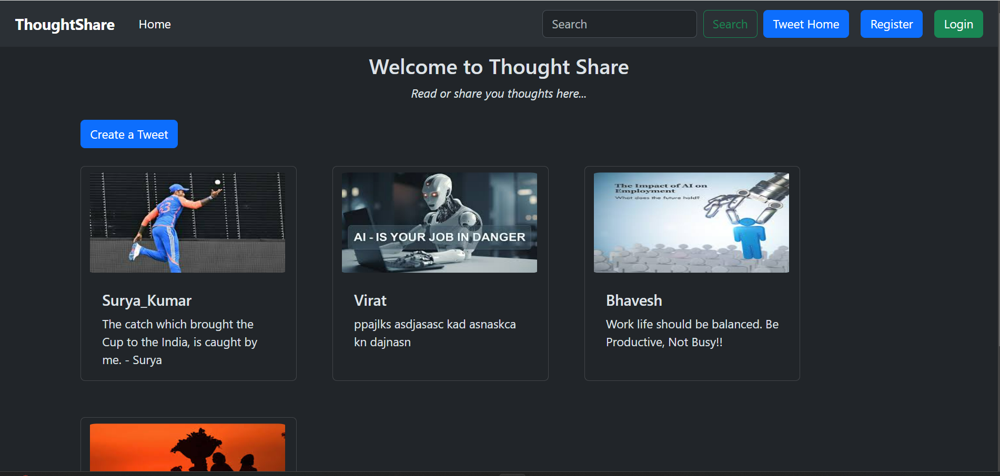
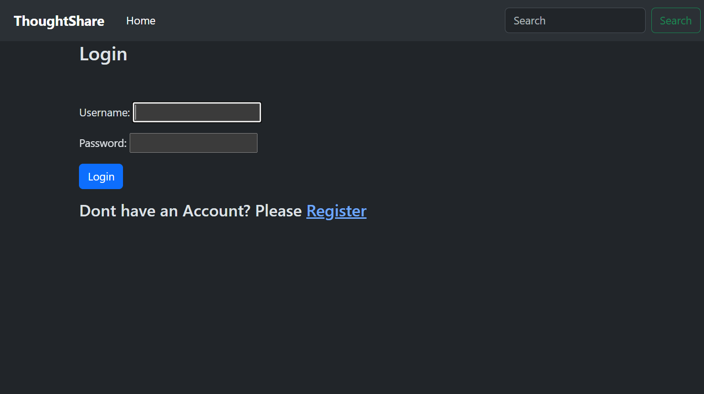

# Thought Share - Blogging Web App

Thought Share is a fully functional blogging web application built using Python and Django. It allows users to create, read, update, and delete blog posts. The application also features login functionality and supports adding images to blogs. The user interface is designed to be simple and user-friendly, making it easy for anyone to use.

## Features

- **User Authentication**: Secure login and logout functionality for users.
- **Create Blog Posts**: Users can create new blog posts with rich text and images.
- **Read Blog Posts**: View all blog posts with a clean and responsive layout.
- **Update Blog Posts**: Edit existing blog posts with ease.
- **Delete Blog Posts**: Remove blog posts that are no longer needed.
- **User-Friendly Interface**: Simple and intuitive UI for seamless user experience.

## Technologies Used

- **Backend**: Python, Django
- **Frontend**: HTML, Tailwind CSS
- **Admin Panel**: Django Admin

## Installation

1. **Clone the Repository**:
    ```sh
    git clone https://github.com/yourusername/thought-share.git
    cd thought-share
    ```

2. **Create a Virtual Environment**:
    ```sh
    python3 -m venv venv
    source venv/bin/activate  # On Windows use `venv\Scripts\activate`
    ```

3. **Install Dependencies**:
    ```sh
    pip install -r requirements.txt
    ```

4. **Run Migrations**:
    ```sh
    python manage.py migrate
    ```

5. **Create a Superuser**:
    ```sh
    python manage.py createsuperuser
    ```

6. **Run the Development Server**:
    ```sh
    python manage.py runserver
    ```

7. **Access the Application**:
    Open your web browser and go to `http://127.0.0.1:8000/` or at any desired port by specifying "runserver [port number]"

## Usage

1. **Register and Login**:
    - Register a new account or login with your existing credentials.

2. **Create a Blog Post**:
    - Click on "New Post" and fill out the form with your blog content and images.

3. **View Blog Posts**:
    - Browse through all blog posts on the homepage.

4. **Update or Delete Posts**:
    - Click on the post you want to update or delete and choose the appropriate action.

## Screenshots


*Homepage displaying blog posts.*


*Registration, login and logout functionality for users*

---

*Developed by Bhavesh*
<br/>
Email: bhaveshkarnewar2@gmail.com
